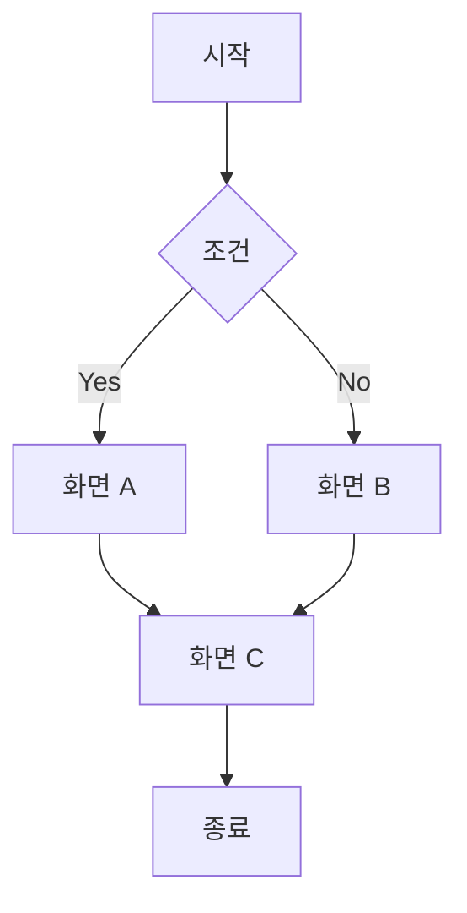

# [기능명] 스토리보드

## 문서 정보

| 항목 | 내용 |
|------|------|
| 기능명 | |
| 문서 버전 | v1.0 |
| 작성일 | |
| 작성자 | |
| 상태 | 작성중 / 검토중 / 확정 |

---

## 1. 개요

### 목적
> 이 스토리보드가 다루는 사용자 흐름의 목적

### 대상 사용자
> 

### 진입점
> 사용자가 이 흐름에 진입하는 경로

---

## 2. 사용자 흐름 (User Flow)

---

## 3. 화면별 상세 스토리

### Scene 1 — [화면명]

**화면 ID:** SCR-001

**화면 설명:**
> 이 화면에서 사용자가 보는 것과 할 수 있는 것

**UI 요소:**
- [ ] 요소 1
- [ ] 요소 2

**사용자 액션:**
| 액션 | 결과 |
|------|------|
| 버튼 A 탭 | 화면 B로 이동 |
| 뒤로가기 | 이전 화면으로 이동 |

**예외/엣지 케이스:**
- 

**와이어프레임:**
> Figma 링크 또는 이미지 삽입

---

### Scene 2 — [화면명]

**화면 ID:** SCR-002

**화면 설명:**

**UI 요소:**
- [ ] 
- [ ] 

**사용자 액션:**
| 액션 | 결과 |
|------|------|
| | |

**예외/엣지 케이스:**

**와이어프레임:**

---

## 4. 알림 / 시스템 메시지

| 상황 | 메시지 | 유형 |
|------|--------|------|
| | | 토스트 / 모달 / 인라인 |

---

## 5. 변경 이력

| 버전 | 날짜 | 변경 내용 | 작성자 |
|------|------|-----------|--------|
| v1.0 | | 최초 작성 | |
