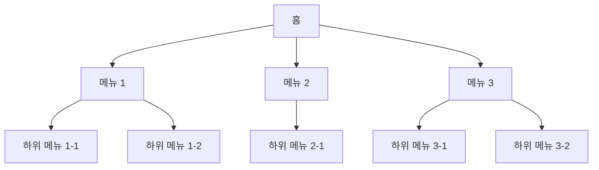

# Information Architecture (IA)

## 문서 정보

| 항목 | 내용 |
|------|------|
| 서비스명 | |
| 문서 버전 | v1.0 |
| 작성일 | |
| 작성자 | |
| 상태 | 작성중 / 검토중 / 확정 |

---

## 1. 사이트맵 (Sitemap)

---

## 2. 화면 목록

| 화면 ID | Depth | 화면명 | URL / 라우트 | 비고 |
|---------|-------|--------|-------------|------|
| SCR-001 | 1 | 홈 | / | |
| SCR-002 | 2 | | | |
| SCR-003 | 2 | | | |
| SCR-004 | 3 | | | |

---

## 3. 내비게이션 구조

### GNB (Global Navigation Bar)
| 메뉴명 | 이동 화면 | 아이콘 |
|--------|-----------|--------|
| | | |

### 하단 탭바
| 탭명 | 이동 화면 | 아이콘 |
|------|-----------|--------|
| | | |

---

## 4. 변경 이력

| 버전 | 날짜 | 변경 내용 | 작성자 |
|------|------|-----------|--------|
| v1.0 | | 최초 작성 | |
