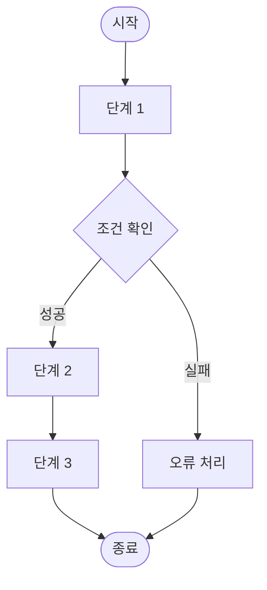
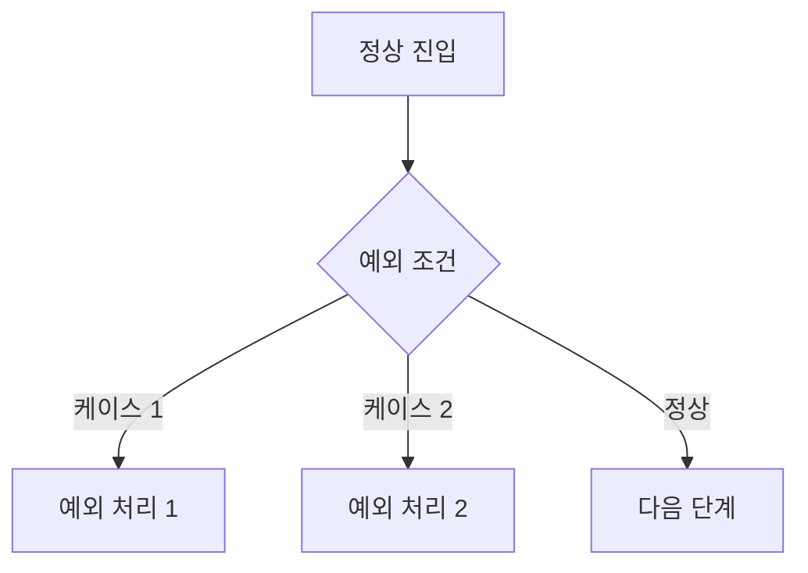

# [기능명] 플로우차트

## 문서 정보

| 항목 | 내용 |
|------|------|
| 기능명 | |
| 문서 버전 | v1.0 |
| 작성일 | |
| 작성자 | |
| 상태 | 작성중 / 검토중 / 확정 |

---

## 1. 서비스 플로우

---

## 2. 예외 플로우

---

## 3. 플로우 설명

| 단계 | 설명 | 담당 | 비고 |
|------|------|------|------|
| 단계 1 | | 프론트엔드 | |
| 단계 2 | | 백엔드 | |

---

## 4. 변경 이력

| 버전 | 날짜 | 변경 내용 | 작성자 |
|------|------|-----------|--------|
| v1.0 | | 최초 작성 | |
